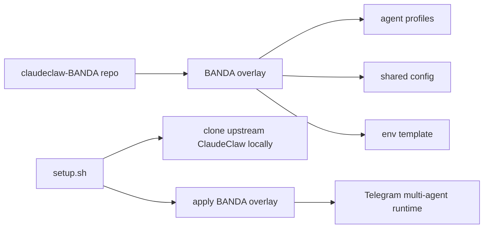

# 🐍 ClaudeClaw BANDA

> MIT-licensed BANDA starter kit / overlay for building a small Telegram multi-agent team on top of ClaudeClaw.

---

## Canonical source / источник

This project is maintained by Aleksei Ulianov / Sprut_AI.
Original repository: https://github.com/AlekseiUL/claudeclaw-BANDA

If you found this project mirrored, repackaged, or redistributed elsewhere, check this repository as the source of truth.

## Attribution / атрибуция

If you reuse, fork, modify, package, or publish this BANDA starter kit, keep the original copyright and license notice and link back to the canonical repository.

## What this repository is

ClaudeClaw BANDA is a starter kit for a small AI-agent team inspired by a “crew” operating model:

- Nacho - coordinator;
- Tuco - fast execution;
- Lalo - marketing / investigation;
- Gale - code / engineering;
- Kim - quality control / documents.

It is designed to run on top of [ClaudeClaw](https://github.com/earlyaidopters/claudeclaw), an external wrapper around Claude Code CLI.

## Important license/provenance note

The root `LICENSE` is MIT and applies only to the files contained in this repository: BANDA overlay, docs, metadata, and `setup.sh`.

This repository contains **BANDA-specific overlay material only**:

- `overlay/agents/` - agent profiles and configs;
- `overlay/.claudeclaw/` - shared BANDA configuration and prompts;
- `setup.sh` - installer that clones upstream ClaudeClaw locally and applies the overlay;
- documentation, metadata, NOTICE, SECURITY, and examples.

This repository **does not redistribute upstream ClaudeClaw source code**.

At the 2026-05-13 cleanup pass, GitHub did not show a license for the upstream ClaudeClaw repository. Because of that, the MIT license here applies to BANDA-specific materials maintained by Aleksei Ulianov / Sprut_AI. It does not relicense upstream ClaudeClaw files cloned from https://github.com/earlyaidopters/claudeclaw.

See: [THIRD_PARTY.md](THIRD_PARTY.md)

---

## Для кого это

Подходит, если ты хочешь не одного ассистента, а маленькую self-hosted команду Telegram-агентов вокруг Claude Code:

- быстро поднять персональную agent-команду на Mac/Linux;
- разделить роли: координатор, исполнитель, маркетолог, программист, ОТК/юрист;
- управлять задачами с телефона через Telegram;
- показать подписчикам или команде живой multi-agent setup.

Не для тех, кто ищет fully hosted SaaS. Это starter kit: твои боты, твоя машина, твои токены, твоя ответственность за запуск.

---

## Architecture



---

## Prerequisites

Install locally before running setup:

- `git`
- `python3`
- Node.js 20+ and `npm`
- Claude Code CLI: `npm install -g @anthropic-ai/claude-code`
- Claude login: `claude login`
- Telegram bots created via [@BotFather](https://t.me/botfather)

The setup script checks `git` and `python3` directly. Node/npm and Claude Code are required when you enter the cloned upstream runtime and run it.

---

## Quick start

### 1. Clone BANDA

```bash
git clone https://github.com/AlekseiUL/claudeclaw-BANDA.git
cd claudeclaw-BANDA
```

### 2. Create Telegram bots

Open [@BotFather](https://t.me/botfather) and create bots for:

- Nacho / coordinator;
- Tuco;
- Lalo;
- Gale;
- Kim.

Keep tokens local. Do not commit them.

### 3. Apply BANDA overlay to a local ClaudeClaw runtime

```bash
./setup.sh runtime/claudeclaw
```

The script will:

1. clone upstream ClaudeClaw into `runtime/claudeclaw`;
2. copy BANDA overlay files into that local runtime;
3. create `.env` from `.env.example` if `.env` does not exist.

### 4. Fill local `.env`

```bash
cd runtime/claudeclaw
nano .env
```

Minimum values:

```bash
TELEGRAM_BOT_TOKEN=your_nacho_bot_token
ALLOWED_CHAT_ID=your_telegram_chat_id
TUCO_BOT_TOKEN=your_tuco_bot_token
LALO_BOT_TOKEN=your_lalo_bot_token
GALE_BOT_TOKEN=your_gale_bot_token
KIM_BOT_TOKEN=your_kim_bot_token
```

### 5. Install and run upstream runtime

Inside the cloned runtime:

```bash
npm install
npm run build
npm start
```

If the upstream runtime supports `agent:start`, start the sub-agents:

```bash
npm run agent:start tuco
npm run agent:start lalo
npm run agent:start gale
npm run agent:start kim
```

---

## Repository structure

```text
claudeclaw-BANDA/
├── overlay/
│   ├── agents/              # BANDA agent profiles
│   ├── .claudeclaw/          # shared BANDA config and coordinator prompt
│   ├── data/board.md         # starter task board
│   ├── CLAUDE.md.example     # owner prompt template
│   └── banner.txt
├── assets/                   # public screenshots / diagrams
├── setup.sh                  # clones upstream locally and applies overlay
├── .env.example              # BANDA env template, no secrets
├── LICENSE                   # MIT for BANDA-specific material
├── NOTICE.md
├── THIRD_PARTY.md
└── SECURITY.md
```

---

## Links

- YouTube: https://youtube.com/@alekseiulianov
- Telegram channel Sprut AI: https://t.me/Sprut_AI
- Telegram chat: https://t.me/+eH-qNIDmud8zNDZi
- AI Операционка: https://t.me/tribute/app?startapp=sJyg
- Upstream tool: https://github.com/earlyaidopters/claudeclaw

## License

MIT for BANDA-specific materials.

Copyright (c) 2026 Aleksei Ulianov / Sprut_AI

Upstream ClaudeClaw is an external dependency/tool and is not relicensed by this repository. See [THIRD_PARTY.md](THIRD_PARTY.md).

---

_"I'm not like them. I never was." — Nacho Varga_
